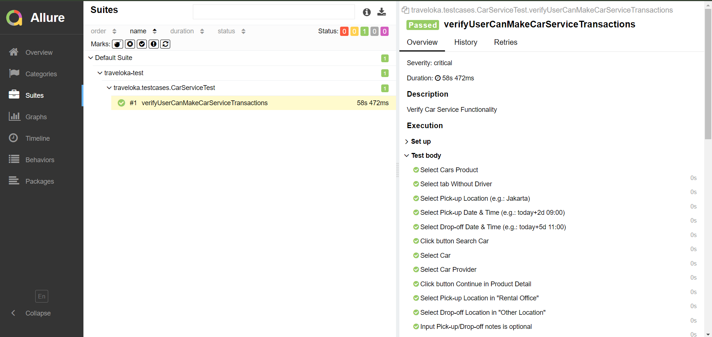

# Car Service Traveloka Automation Test with TestNG and Allure Reporting

## Overview
This project contains automated tests for Traveloka Take Home Test.

## Requirements
- Java Development Kit (JDK) 8 or higher installed
- Maven installed
- Installed Allure Report

## Setup
1. Clone this repository to your local machine:

    ```bash
    git clone https://github.com/your_username/your_repository.git
    ```

2. Navigate to the project directory:

    ```bash
    cd your_repository
    ```

3. Build the project using Maven:

    ```bash
    mvn clean install
    ```

## Execution
Execute the test suite using Maven:

```bash
mvn test
```

## Viewing Reports
After the test execution completes successfully, generate and view the Allure report:

1. Generate the Allure report:

    ```bash
    allure serve target/allure-results
    ```

2. Open the generated report in your browser (usually accessible at http://localhost:64510).

## Structure
- **src/test/java**: Contains the test classes and packages.
- **allure-results**: Contains the compiled classes and generated reports.

## Result Example


